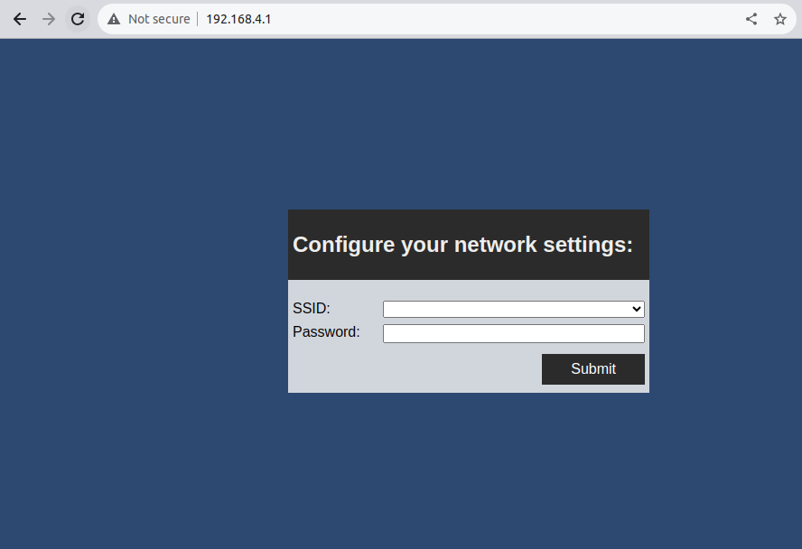

# micropython-wifi-setup-server
Create an access point on a ESP32 board with micropython to configure WiFi
credentials.

## Description
This package facilitates creation of a Access Point server to configure
ESP32 WiFi connectivity. It can be passed as arguments of the configuration
function PINs to be used as network status.

Network credentials will be saved as a JSON at `/config/wifi_credentials.json`.
Process will try to reconnect if lost, but will remove file if connection was
not possible.

## Usage
`wifi_setup_server` must be copied to esp32 lib folder. To use `ampy` it is
necessary to install `adafruit-ampy` using pipy. Bellow there is an example
of a bash script to 'build' a ESP32 board.

```bash
export MICROPYTHON_PACKAGES="../../micropython-lib/micropython"
export CUSTOM_PACKAGES="../../custom-packages/"

# Remove previous files from board
echo -e "# Clean board files:"
ampy --port /dev/ttyUSB0 rmdir /packages
ampy --port /dev/ttyUSB0 rmdir /lib
ampy --port /dev/ttyUSB0 rmdir /code
ampy --port /dev/ttyUSB0 mkdir /lib

# List available configuration files
echo -e "# List config files:"
ampy --port /dev/ttyUSB0 ls /config
# ampy --port /dev/ttyUSB0 rm /config/wifi_credentials.json

# Install (copy) packages to lib folder on ESP32 board
echo -e "# Install packages"
ampy --port /dev/ttyUSB0 put $MICROPYTHON_PACKAGES/urequests /lib/urequests
ampy --port /dev/ttyUSB0 put $CUSTOM_PACKAGES/micropython-wifi-setup-server/wifi_setup_server /lib/wifi_setup_server
ampy --port /dev/ttyUSB0 ls /lib/

echo -e "# Pushing boot:"
ampy --port /dev/ttyUSB0 put ./boot/boot.py boot.py
ampy --port /dev/ttyUSB0 ls ./

echo -e "\n# Pushing code:"
ampy --port /dev/ttyUSB0 put ./code
ampy --port /dev/ttyUSB0 ls ./code

echo -e "\n# Pushing packages:"
ampy --port /dev/ttyUSB0 put ./packages
ampy --port /dev/ttyUSB0 ls ./packages

ampy --port /dev/ttyUSB0 reset
```

It is possible to import wifi_setup_server and configure the server.

```python
"""Crete a AP server to configure WiFi connection."""
import machine
import time
from wifi_setup_server.server import WifiSetupServer

# Internet connection Status PIN
pin_board = machine.Pin(2, machine.Pin.OUT)
pin_red = machine.Pin(15, machine.Pin.OUT)
pin_yellow = machine.Pin(12, machine.Pin.OUT)
pin_green = machine.Pin(13, machine.Pin.OUT)
``
# Clean board pins
internet_object = WifiSetupServer(
    config_server_pin=pin_red,
    connecting_wifi_pin=pin_yellow,
    connected_wifi_pin=pin_green)


def main():
    """Start function to the board."""
    board_id = internet_object.get_board_id()
    while True:
        print("board_id:", board_id)
        internet_object.configure_wifi()
        time.sleep(1)
```

`configure_wifi` function will create an access point with name `ESP32
[board indentification]` with password="password". It is possible to change
access point password using `WifiSetupServer` `access_point_password` argument.

User can connect to access point and access `192.168.4.1` to configure WiFi
connection with SSID and password that will be used be the board to connect with
the network.

Using submit button will make ESP board try to connect at the network, dropping
the access point. If connection was not possible, access point will be
available again in 30 seconds.

*Using the access point and connecting to 192.168.4.1, it is possible to configure WiFi connection using inteface.*


## Connection indicators
It is possible to use board PINs to sinalize the status of the connection,
passing PINs to WifiSetupServer construtor args config_server_pin,
connecting_wifi_pin and connected_wifi_pin will. Description of the status:
- **config_server_pin:** This pin will be on is the AP server is available and
  on credentials were provided before.
- **connecting_wifi_pin:** This pin will be on if ESP is trying to connect with
  WiFi. When this is happening, AP server will be not available.
- **connected_wifi_pin:** This pin will be on if ESP successful connected to a
  WiFi network.
